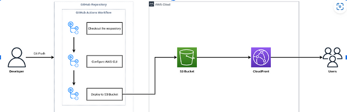

# Cloud Challenge

This project follows the structure outlined by Forrest Brazeal and demonstrates my expertise in AWS cloud services, automation, and CI/CD.

## Overview
This project consists of a personal portfolio/resume website hosted entirely on AWS. The stack includes:
- **Frontend:** Next.js (built and deployed to AWS S3 and served via CloudFront)
- **Backend:** AWS Lambda, API Gateway, and DynamoDB to track visitor count
- **CI/CD:** GitHub Actions for automated build, linting and deployment

## Tech Used
- **AWS Services:** S3, CloudFront, API Gateway, Lambda, DynamoDB, IAM (For assume role in GitHub Actions)
- **CI/CD:** GitHub Actions with OIDC
- **Programming Languages:** JavaScript, Python
- **Security & Monitoring:** IAM roles, OIDC For AWS Credentials, CloudWatch, AWS Secrets Manager
 
## Features
- **Hosting:** The portfolio is hosted on **AWS S3** and served via **CloudFront** for fast content delivery
- **Visitor Counter:** A **serverless backend** using **AWS Lambda/API Gateway/DynamoDB** tracks and displays visitor count
- **CI/CD Pipeline:** **GitHub Actions** automatically deploys changes to **S3** and invalidates the **CloudFront** cache
- **Security Best Practices:** IAM roles for least-privileged access, this includes in my GitHub Actions Workflow, not using AWS Access Key Or Secret Access Key, instead, assuming role with OIDC, HTTPS enforcement via CloudFront, Private S3 Bucket
- **Terrafrom** for distaster recovery and quickly building and destroying infrastructure

## Deployment

### CI/CD via GitHub Actions
- Push to the `main` branch; trigger the deployment workflow (`deploy-frontend.yml`) only when `frontend` folder files are changed

## Live Demo
You can view the live version of my Cloud Portfolio here: [joshcod.es](https://joshcod.es) (still in content/design work, currently used more for Full Cloud infrastructure and CI/CD purposes).

## Lessons Learned
- **Serverless Architectures**: Implementing API Gateway/Lambda/DynamoDB
- **CI/CD Automation**: Leveraging GitHub Actions for automatic deployments
- **Security Best Practices**: IAM role configurations, Using Private S3 bucket served via CloudFront for HTTPS enforcement

## Things to Come
- ~~Terraform entire project~~ (just needs backend module)
- Add a contact form with SES email integration

## Acknowledgments
- AWS documentation & the great AWS community for support
!
---
Thanks all!

